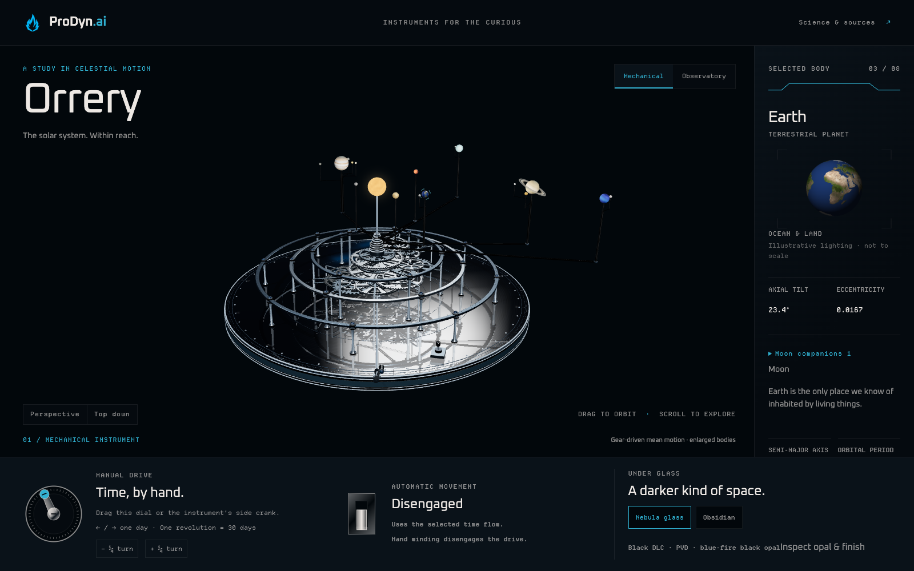
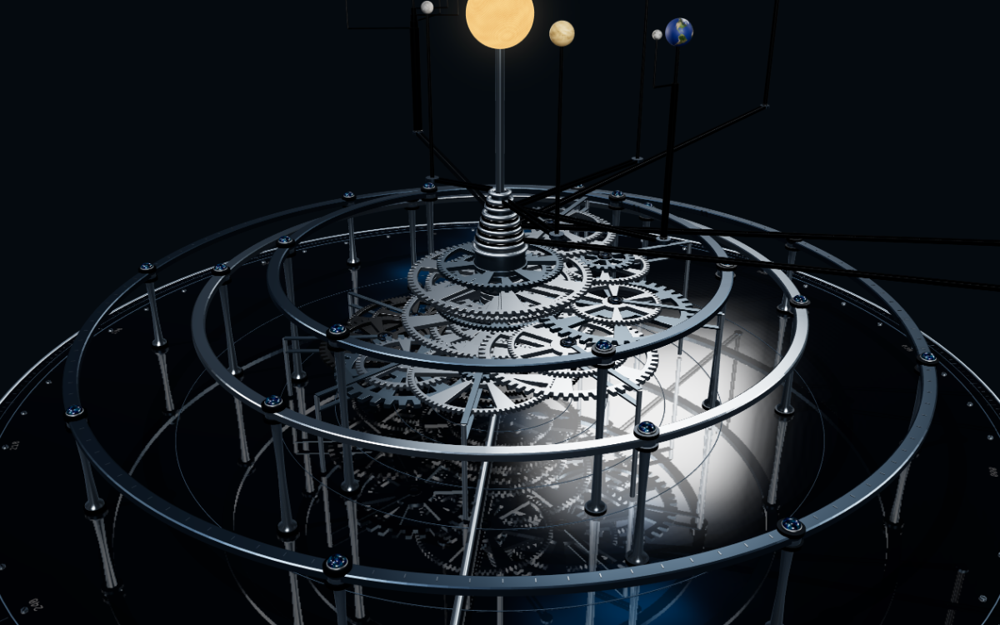
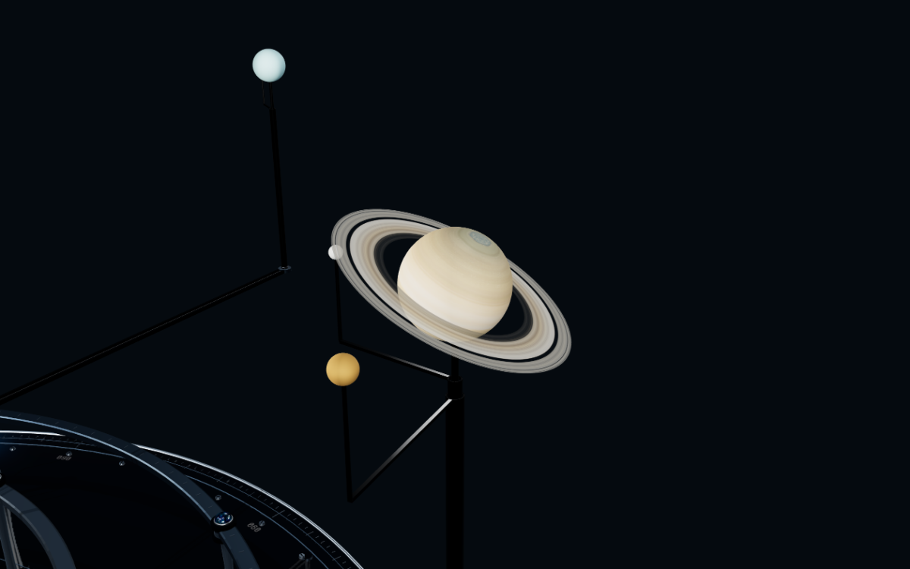

# Orrery

**The solar system. Within reach.**

Turn a hand crank and watch time travel through a silver-and-black clockwork solar system. Inspect its machinery, get closer to a planet or moon, or switch to Observatory to explore approximate astronomical orbits.

[Explore Orrery](https://orrery.prodyn.ai/) · [MIT License](LICENSE) · [Science and sources](docs/science.md) · [Report an issue](https://github.com/cygnostik/orrery/issues)



## Status
**v0.6.0-beta.1** — a static web application with installable PWA support, offline application assets, and optional updates. The entire instrument runs on the visitor's device. No backend, database, account or server-side GPU is required. Native executables and screensavers are not included.

This release extends time to 2250, gives each moon its own inspector readout, and adds Sun-dominant lighting with approximate date-driven Earth orientation. The Sun has a refreshed surface and the displayed bodies cast ordinary model shadows in Lights out. The original machinery and blue-opal inlays are preserved.

## Run locally
Prerequisite: a Node version supported by the pinned Vite release (Node ^20.19 or >=22.12).

```sh
npm ci
npx playwright install chromium webkit
npm run build
npm run preview -- --port 5195 --strictPort
```
Open `http://127.0.0.1:5195/`. The server binds only to loopback. Serve `dist/`, not the project or the design-system source tree. A normal module build is not a double-click `file://` application.

## Explore
- Mechanical: a cool-metal museum instrument with a connected drive train: crank → compound gear reductions → hollow output sleeves → attached planet arms. Graphics contains the Nebula glass and Obsidian finishes, opal inspection and resolution controls. Opening Follow the drive shows its reduction path and geared year, with restrained gear highlighting outside Lights out.
- Wind the actual side crank or the larger control-panel dial in either direction; one revolution advances 30 simulated days. The dial also accepts arrow keys (one day), Shift + arrow (one revolution), Home/End (model bounds), and quarter-turn buttons. Winding disengages automatic movement.
- Flip the instrument’s physical switch or the accessible Automatic movement switch to use the selected time flow. Both share one clock; the accessible switch works in both presentations alongside the crank, date and time-flow controls.
- Observatory: inclined, eccentric astronomical ellipses; switch to true distance mapping if desired. Bodies remain enlarged and may be very small in a system-wide view.
- Select planets using the planet row or the scene. Double-click or use Inspect to frame and follow a body without changing playback. Follow tracks position, not rotation; orbit and zoom remain available. Pan or choose Perspective/Top down to release the camera. Info, Settings, Graphics and Help organize the inspector; the planet row remains available.
- Change the UTC date; play, pause, reverse or accelerate time. Date entry selects noon UTC. The clock clamps at the science model's supported endpoints.
- Switch on **Lights out** for Sun-dominant illumination and ordinary model shadows. Earth's globe turns with the selected UTC date in either lighting state. These shadows use enlarged display geometry, not eclipse predictions; see [sunlight and Earth orientation](docs/sunlight.md).
- Include Pluto independently; it is labeled as a dwarf planet.
- Show/hide ten curated moons: Earth’s Moon; Io, Europa, Ganymede and Callisto; Enceladus and Titan; Miranda; Triton; and Charon (with Pluto enabled). Click a moon or use its Moon companions Inspect action to show its own parent, orbital direction, approximate orbital radius/period, mean radius, fact and source in the main inspector. The parent system stays selected in the planet row. Enceladus opens toward its illustrated south-polar fractures.
- Each selected planet has a distinct surface/cloud portrait rather than a shared wireframe, plus reference axial tilt and eccentricity. Saturn emphasizes its rings; Uranus its tilted axis; Pluto is explicitly illustrated. Desktop reference details scroll within the inspector without stretching the stage.
- Labels, fullscreen where the browser allows it, keyboard-accessible planet controls and a source dialog are included.

The instrument starts paused, with labels off. Reduced-motion preference changes pause it. Click the machinery/background or press Escape to deselect without snapping the camera. Right-drag or use two fingers to pan.

No sound, accounts, application analytics, live telemetry, advertising, or external runtime image/font dependencies. Standard web-host access and security logging may still apply.

## A closer look





Planet imagery: [Solar System Scope](https://www.solarsystemscope.com/textures/), [CC BY 4.0](https://creativecommons.org/licenses/by/4.0/), rendered with original geometry and lighting. Moon surfaces are original illustrations. See [asset credits](docs/assets.md).

## Install and use offline

- **Chrome / Edge:** use the browser's install command or Orrery's Install button when offered.
- **iPhone / iPad:** open the site in Safari, then **Share → Add to Home Screen**.
- **Supported macOS Safari:** **File → Add to Dock**.
- Wait for the footer's offline-ready confirmation before disconnecting. A first visit and successful asset download are required; external source links need internet access.
- Updates are offered rather than silently interrupting an inspection. Browser storage can be evicted or cleared; reconnecting alone may not repair a partly deleted copy. Follow **Install & offline help** if offline access remains unavailable.

See [PWA behavior](docs/pwa.md) and [browser support and verification boundaries](docs/browser-support.md). WebGL 2 and JavaScript are required for 3D; source information and a schematic remain available when rendering is unavailable. Viewport emulation is not a physical-device performance test.

## Science and presentation
See `docs/science.md` and the in-app Science & sources panel. One JPL long-interval approximation covers the supported 1800–2250 range, without switching models at 2050. It is not a precision ephemeris. Earth represents the Earth–Moon barycenter; UTC is used as approximate TDB; the fitted Pluto elements are historical. The supported endpoint is 2250-01-01 at UTC midnight, so the last full date selectable at noon is 2249-12-31.

Mechanical motion is derived from a tested connected gear/shaft topology and actual attached arm transforms, not independent planetary animations. Its uniform mean motion approximates reference periods with finite tooth ratios; Observatory retains the astronomical calculation. Gear dimensions/mesh relationships and selected swept clearances are tested, but this is not manufacturing-ready CAD, torque/backlash simulation or comprehensive solid collision certification. See `docs/mechanical-drive.md` for the exact ratios, period errors and boundaries. Texture maps are imagery-derived artistic maps with source caveats. Pluto is procedural. The seeded background stars are decorative, not a sky catalogue. No rotational ephemeris or real-time observation is implied.

Moon descriptors are sourced, but their phases and planes are illustrative circular demonstrations, with independently exaggerated local spacing and sphere sizes in both distance modes. Mechanical moon motion follows the shared crank through schematic enclosed reductions; the hidden internals have not been engineered to fit inside the slender supports. See `docs/moons.md` for sources, the Io/Europa period discrepancy, the Pluto–Charon barycenter limitation and adopted values.

Footer motion follows playback, viewport visibility and reduced-motion preference; it does not run an independent application clock.

## Design and rights
Original Orrery source is [MIT licensed](LICENSE), copyright Chris M. / Promethean Dynamic. Planet textures and imagery-derived screenshots retain CC BY 4.0 attribution; Oxanium and Departure Mono retain the SIL Open Font License. Three.js retains its MIT notice. Names and logos do not grant trademark or endorsement rights. See [complete notices](public/licenses/NOTICE.txt) and [asset provenance](docs/assets.md).

## Verification
```sh
npm run test:unit
npm run build
npm test
npm run test:pwa
npm run test:compat
npm audit
# After staging the files intended for publication:
npm run audit:public
```
The main browser suite discovers an installed Edge/Chrome executable or uses Playwright Chromium; `ORRERY_BROWSER` selects a Chromium executable explicitly. Compatibility coverage targets Chromium and WebKit. WebKit engine tests are not a certification of every Safari release or physical Apple device. See the [browser report](docs/browser-support.md) for actual results and limits.

For contributor media exports, run the preview and then `ORRERY_URL=http://127.0.0.1:5195 npm run media`. The media script captures the actual renderer rather than substituting an artist's rendition. Review images before publication.

## Hosting and contributing

See the [roadmap](ROADMAP.md) for deferred refinements, including smoother moon-shadow edges.

Deploy **only `dist/`** to a static HTTPS host. See [deployment and updates](docs/deployment.md), [contributing](CONTRIBUTING.md), and [security and privacy](SECURITY.md). Test results, internal research captures and private deployment data are intentionally excluded from this repository.

**Made by Promethean Dynamic Nerdiness.**

**Powered by [TrustEdge.gt](https://TrustEdge.gt/) Engineered Infrastructure.**
